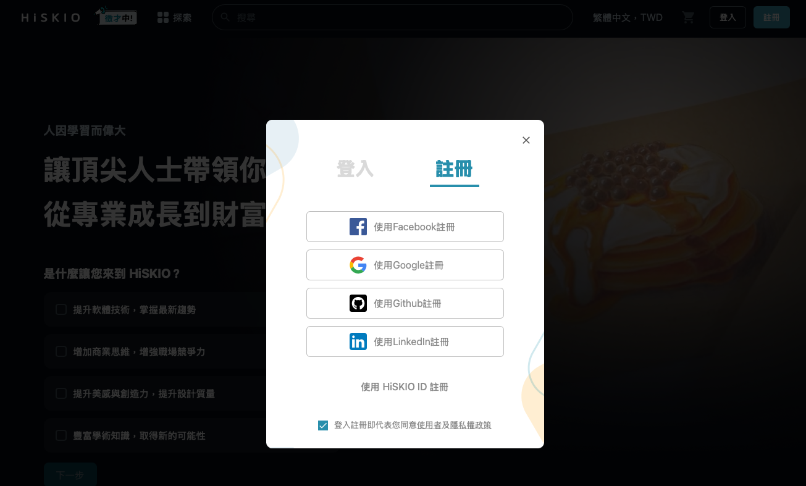
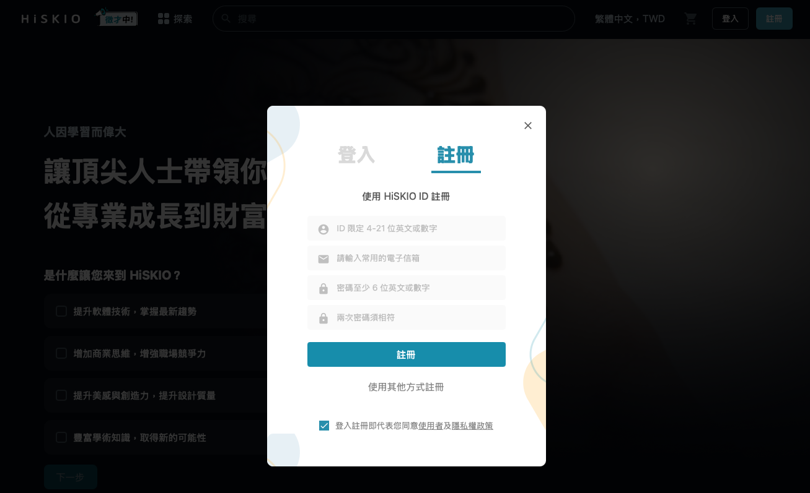
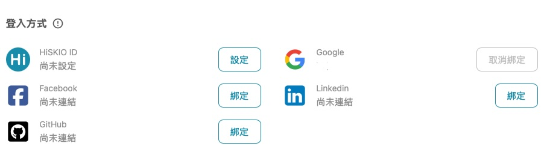
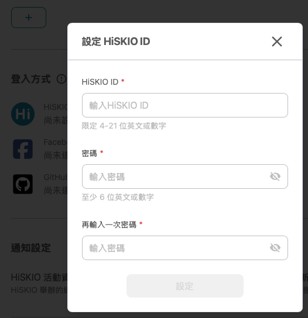

有關的文章： [會員註冊/登入/帳號設定](/zh-tw/category/5pyd5zoh6ki75yaklezuwfpslulpomzoqk3lrpo-kn63pb/)

# 登入方式與社群綁定

本篇說明 HiSKIO 帳號的註冊與登入機制、如何綁定多種登入方式，以及社群登入失敗時如何處理。

  

### HiSKIO 的帳號機制

  

HiSKIO 提供 5 種註冊帳號的方式：HiSKIO ID（Email + 自訂密碼）、Facebook、Google、LinkedIn、GitHub。一個人可以擁有多個會員帳號，****每一種登入方式都可以各自建立會員帳號****——你可以彈性選擇分開使用（例如個人與工作各開一個），也可以把多種登入方式綁定到同一個會員帳號。

  

#### 想用多種方式登入同一個會員帳號 → 要先綁定

  

如果你希望「不同登入方式都能進到同一個會員帳號」，必須先在【帳戶設定】中把它們綁定起來。  
如果****沒有綁定****就用另一種方式登入，系統會直接為你建立一個新的會員帳號，這就是為什麼有些使用者會在登入後****找不到課程****：原因通常不是課程消失了，而是用了****新的登入方式****建立 & 登入了****新的會員帳號****。詳細排解流程請參考 [帳號查詢與「課程不見了」排解](about:blank)。

  

### 註冊 HiSKIO 會員

  

#### 註冊步驟

  

1.  點選 HiSKIO 網站右上角的「註冊」
2.  選擇你想要的註冊方式

  

#### 兩種註冊方式

  

****方式 A：社群登入註冊****

  

可使用 Facebook、Google、LinkedIn、GitHub。一鍵授權後即完成註冊，不需額外記憶帳號密碼。

  

  

****方式 B：HiSKIO ID 註冊****

  

自行輸入 HiSKIO ID、Email 與自訂密碼來註冊，至信箱收取驗證信即完成註冊。

  

  

#### 沒收到註冊驗證信件，該怎麼辦？

  

請先檢查「垃圾郵件」或「其他分類信件」資料夾。若還是沒收到，可透過以下管道聯繫客服：

  

-   寄信至 [support@hiskio.com](mailto:support@hiskio.com)

  

> 若你的 Email 已使用某種社群方式註冊過 HiSKIO，再用同一個 Email 進行 HiSKIO ID 註冊會失敗。此時請直接用該社群方式登入，或參考下方「綁定多種登入方式」將社群帳戶綁定到 HiSKIO ID。

  

  

### 綁定多種登入方式

  

綁定的好處：未來不論用哪一種綁定過的方式登入，都會導向同一個帳戶，不會因為登入方式不同而找不到課程。

  

> 💡 ****建議至少設定兩種登入方式****：當主要登入方式臨時出問題（例如 Facebook 帳號被鎖、忘記密碼），仍可用備用方式進入帳號繼續上課。

  

#### 從 HiSKIO ID 帳號 → 登入方式

  

1.  登入後，點選右上方個人頭像 →【帳戶設定】
2.  在「登入方式」區塊選擇要綁定的社群
3.  點選「綁定」並完成授權

  

  

#### 從社群登入註冊的帳號 → 設定 HiSKIO ID

  

如果你一開始是用社群登入註冊（例如 Facebook），也可以為這個帳戶額外設定 HiSKIO ID 與密碼，未來就能用「HiSKIO ID + 密碼」登入。

  

操作流程：

  

1.  登入後，點選右上方個人頭像 →【帳戶設定】→【登入方式】
2.  在最上方的「HiSKIO ID」欄位點選「進行設定」
3.  設定 HiSKIO ID 與密碼

  

  

  

完成設定後，這個帳戶即可使用「HiSKIO ID + 設定的密碼」登入。

  

  

### 社群登入失敗的處理方式

  

點擊 Facebook、Google、LinkedIn、GitHub 登入後，若遇到錯誤、頁面卡住或被導回未登入狀態，請依序檢查：

  

#### 1\. 確認你曾經用該社群註冊或綁定過

  

若該社群帳號從未在 HiSKIO 註冊或綁定，點擊社群登入會自動建立****新帳號****，並不會綁回你原本的帳戶。如果這不是你預期的，請改用原本的登入方式，或參考 [帳號查詢與課程不見了排解](/zh-tw/article/5biz6jmf5pl6kmi6iih44cm6kqy56il5lin6kal5lqg44cn5o6s6kej-hipkzv/) 確認。

  

#### 2\. 確認該社群帳號本身可正常使用

  

請嘗試直接登入該社群網站（例如 Facebook 主站）。若社群帳號本身有問題，請先在該社群處理。

  

#### 3\. 重新整理頁面再試一次

  

偶爾是瀏覽器 cookie 或網路造成的暫時性問題。

  

#### 仍無法解決

  

請聯繫客服並提供：

  

-   嘗試的登入方式（FB / Google / LinkedIn / GitHub）
-   錯誤訊息截圖（如有）
-   註冊時使用的 Email

  

寄信至 [support@hiskio.com](mailto:support@hiskio.com)

  

  

### 注意事項

  

-   ****【帳戶設定】中綁定的「聯絡用 Email」不等於社群登入綁定****：前者是接收通知信用的 Email，後者才是真正能用該社群進入帳號的綁定
-   HiSKIO ****不提供「課程帳號轉換」服務****，請在購買課程前確認這個帳號是否是你未來會繼續使用的帳戶

更新時間： 07/05/2026
