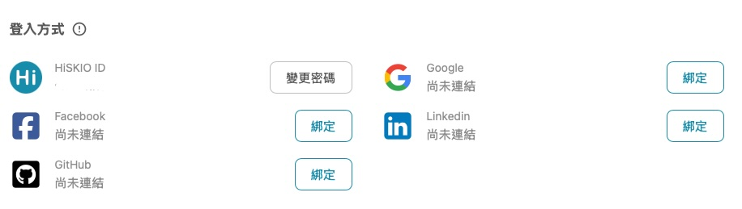
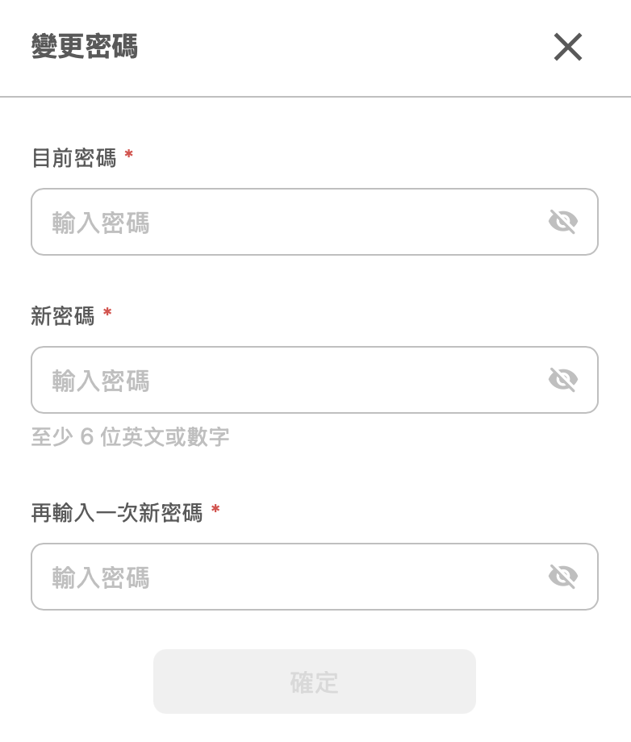
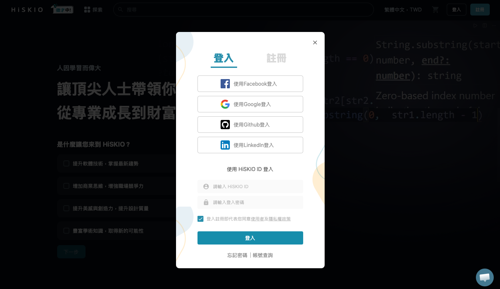
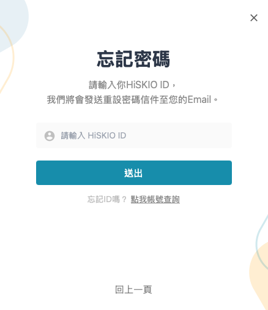
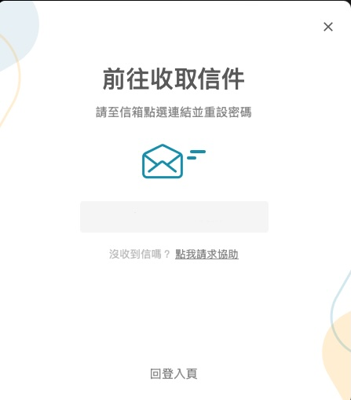
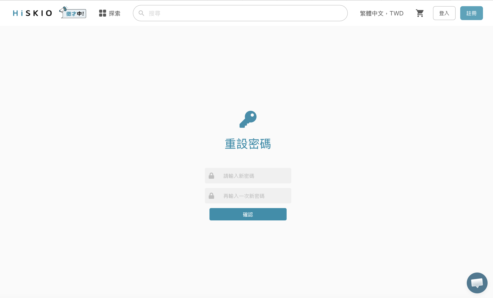

有關的文章： [會員註冊/登入/帳號設定](/zh-tw/category/5pyd5zoh6ki75yaklezuwfpslulpomzoqk3lrpo-kn63pb/)

# 密碼管理

本篇說明 HiSKIO 帳號的密碼更改與重設流程。

  

### 更改密碼（你知道現在的密碼，想換新的）

  

#### 操作流程

  

1.  登入後，點選右上方個人頭像 →【帳戶設定】
2.  點選左方選單的【登入方式】
3.  在 HiSKIO ID 欄位按「變更密碼」

  

  

填入新密碼後，按下確認即完成更改。

  

  

  

### 忘記密碼（不知道現在的密碼，想重設）

  

當初註冊帳號的 Email 信箱將是你重設密碼的重要管道。

  

#### 操作流程

  

****1\. 在登入頁面點選「忘記密碼」****

  

  

請輸入你的 HiSKIO ID，我們將會發送重設密碼信件至你的 Email。

  

  

****2\. 收取「密碼重置信」****

  

至你的信箱收取由「HISKIO 平台」寄出的信件。若沒收到，請檢查「垃圾郵件」或「其他分類」資料夾。

  

  

依照郵件指示重新設定一組新密碼。

  

  

按下按鈕後，即可使用新密碼登入你原本的帳號。

  

  

### 注意事項

  

-   若你之前並未設定 HiSKIO ID、是透過社群帳號登入，****無法****使用「忘記密碼」找回——因為這個帳號本來就沒有設定過 HiSKIO 密碼。請直接用原本的社群帳號登入；若社群登入失敗，請參考 [登入方式與社群綁定](/zh-tw/article/55m75ywl5pa55byp6iih56s576k57ab5a6a-115db2d/) 的「社群登入失敗的處理方式」
-   ****建議至少設定 2 種登入方式作為備援****：若主要登入方式臨時出問題（例如忘記密碼、社群帳號被鎖），仍能用備用方式進入帳號繼續上課。設定方式請參考 [登入方式與社群綁定](/zh-tw/article/55m75ywl5pa55byp6iih56s576k57ab5a6a-115db2d/) 的「綁定多種登入方式」
-   找不到課程不一定是密碼問題，可能是登入到不同帳號了。請參考 [帳號查詢與課程不見了排解](/zh-tw/article/5biz6jmf5pl6kmi6iih44cm6kqy56il5lin6kal5lqg44cn5o6s6kej-hipkzv/) 確認

  

  

### 想變更社群帳號的綁定？

  

社群登入方式（Facebook、Google、LinkedIn、GitHub）的密碼****不由 HiSKIO 處理****，請至該社群網站變更。

  

如果是想要****綁定新的社群、取消綁定既有社群、設定 HiSKIO ID****，請至【帳戶設定】→【登入方式】操作，相關流程請參考 [登入方式與社群綁定](/zh-tw/article/55m75ywl5pa55byp6iih56s576k57ab5a6a-115db2d/)。

  

  

### 仍無法解決？

  

請聯繫客服並提供：

  

-   註冊時使用的 Email
-   嘗試的操作步驟與遇到的錯誤訊息（如有）

  

寄信至 [support@hiskio.com](mailto:support@hiskio.com)

更新時間： 07/05/2026
