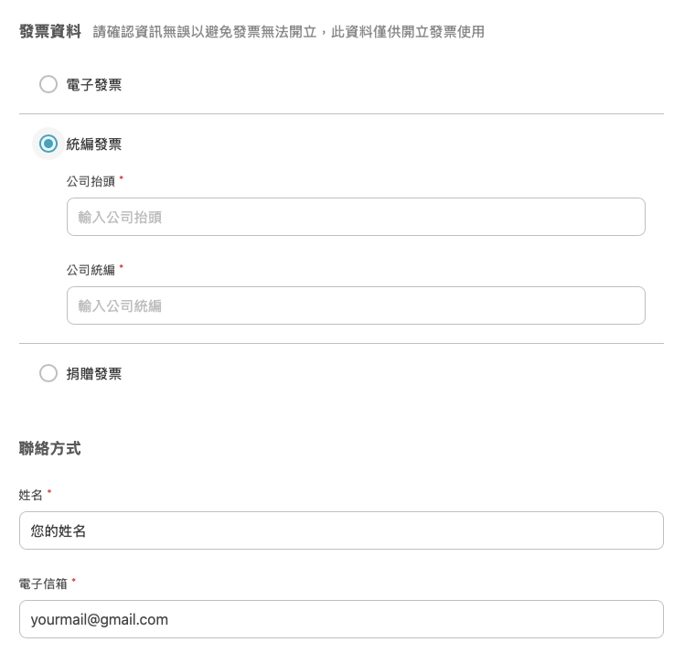
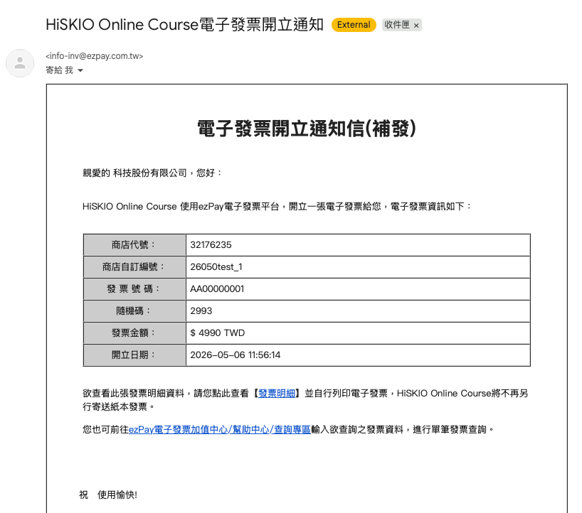
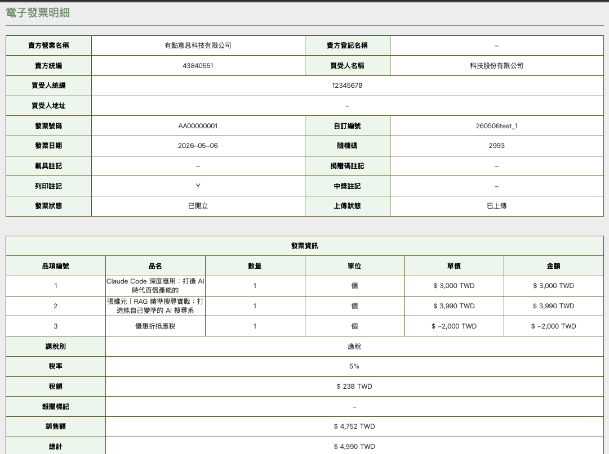

有關的文章： [課程購買](/zh-tw/category/6kqy56il6lo86lk3-q6krs8/)

# 統編發票｜申請與報帳指南

本篇專為公司／單位報帳需求設計，說明 HiSKIO 統編發票如何申請、會收到什麼樣的發票，以及如何用於報帳。

  

> 💡 一般電子發票（無統編）的說明請參考 [關於電子發票](/zh-tw/article/6zec5pa86zu75a2q55m856wo-cmuoya/)。

  

  

### 為什麼選統編發票？

  

公司報帳通常需要****打統一編號****，沒選統編發票多數公司會無法報帳。

  

建議你****先閱讀本篇並與貴司 HR／會計確認****後再購買，避免事後無法報帳的困擾。

  

  

### 企業採購的建議做法

  

若是公司要為員工購買課程，****建議直接使用要上課的職員帳戶****循下方流程購買並填寫統編。一方面更符合實際使用需求（職員可直接登入學習），一方面也符合大多數公司的報帳作業。

  

> 若一次需大批採購、且金額超過 ****30 萬元****，請來信 [hiskio@hiskio.com](mailto:hiskio@hiskio.com) 與我們接洽。

  

  

### 怎麼申請

  

於購買時於結帳頁面選擇「****統編發票****」，並填寫：

  

1.  ****公司抬頭****（須與營業登記名稱一致）
2.  ****統一編號****
3.  ****收件 Email****（電子發票寄送地址）

  

  

> ⚠️ ****發票一經開立恕不接受換開****。請於購買時就確認三項資訊皆正確，再送出訂單。

  

  

### 你會拿到什麼

  

完成結帳後，你會收到：

  

-   ****購買成功通知****
-   ****電子發票信件****

  

電子發票信件如下：

  

  

#### 查看發票明細

  

點擊信件中的【****發票明細****】按鈕，即可進入明細頁面查看完整資訊：

  

  

明細頁面包含：

  

-   公司抬頭、統一編號
-   ****課程清單****（買幾堂列幾堂）
-   各課程小計與總金額
-   發票開立日期、發票號碼

  

> 若同學報帳時需要填寫 HiSKIO 公司資訊，可參考 [公司登記資料](https://twincn.com/item.aspx?no=43840551)。

  

  

### 如何用於報帳

  

-   將電子發票信件或明細頁截圖／列印，作為會計憑證附在請款單上
-   部分公司會接受電子檔直接附件，視貴司會計流程而定
-   若會計需要紙本，可列印明細頁

  

  

### 購買時忘了選統編發票／輸入時打錯統編怎麼辦？

  

建議的處理方式：請至【訂單紀錄】****申請退費至「我的錢包」****，退費完成後再重新購買、購買時記得選統編發票並填寫正確資訊。透過錢包重新購買可立即到帳，不需等銀行作業。

  

退費與我的錢包說明請參考：

-   [退費規定｜如何申請退費](/zh-tw/article/6yca6lk76kap5a6a772c5aac5l2v55sz6kul6yca6lk7-1n22a1s/)
-   [退款入帳時間與我的錢包](/zh-tw/article/6yca5qy5ywl5biz5pmc6zat6iih5oir55qe6yyi5yyf-1ec9kkm/)

  

#### 若操作上遇到問題

  

請聯繫客服 [support@hiskio.com](mailto:support@hiskio.com)，並備妥以下資訊以利處理：

  

1.  訂單編號（例：260401test）
2.  原發票號碼
3.  公司抬頭（與營業登記一致）
4.  統一編號
5.  收件 Email

  

  

### 仍無法解決？

  

請聯繫客服並提供：

  

-   註冊時使用的 Email
-   訂單編號
-   你的需求

  

寄信至 [support@hiskio.com](mailto:support@hiskio.com)

更新時間： 07/05/2026
