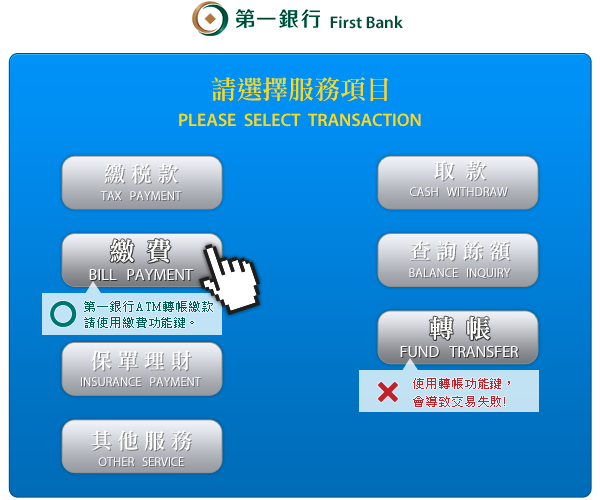
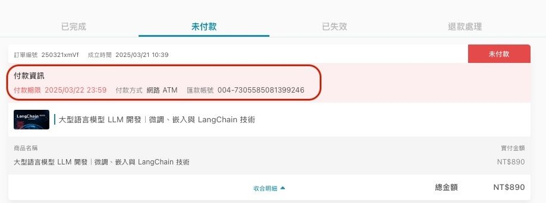

有關的文章： [課程購買](/zh-tw/category/6kqy56il6lo86lk3-q6krs8/)

# 課程付費

HiSKIO 透過第三方支付服務平台「統一金流、Stripe、PayPal、信用卡分期、超商代碼（僅限台灣）、ATM 付款（僅限台灣）」進行收款，付款方式相當多元便利。

  

當你繳款後收到購買完成通知時，代表課程的付費部分完成，課程即將開通。

  

  

### 信用卡一次付清

  

支援的卡別：

  

-   VISA
-   MasterCard
-   JCB
-   銀聯

  

  

### 信用卡分期

  

分期付款僅限結帳金額高於新台幣 2,000 元時提供，可分 ****3 期（滿 2,000 元）／ 6 期（滿 2,500 元）零利率****，

  

目前提供以下銀行：

  

-   國泰世華商業銀行
-   中國信託商業銀行
-   玉山商業銀行
-   台新國際商業銀行
-   聯邦商業銀行
-   永豐商業銀行
-   遠東國際商業銀行
-   第一商業銀行
-   滙豐（台灣）商業銀行
-   星展（台灣）商業銀行

  

> ⚠️ 上述銀行清單以金流服務商當下實際合作為準。

  

  

### ATM / Web ATM 轉帳

  

> ⚠️ 訂單金額超過 5 萬元時，無法選擇 ATM / Web ATM 轉帳。

  

若你使用的銀行非以下三家，需****自行負擔跨行手續費****：

  

-   臺灣銀行
-   中信銀行
-   國泰世華銀行

  

若****訂單金額超過 3 萬元****，請透過 ATM 選擇「****繳費****」功能進行繳費。完成付款後，約半至一小時內會收到購買完成通知。（每間銀行畫面不同，下圖僅供參考）

  

  

  

### 超商付款

  

可選擇於 ****7-Eleven**** 進行超商付款，需自行負擔手續費。

  

> ⚠️ 訂單金額超過 2 萬元時，無法選擇超商付款。

  

取得付款代碼並完成付款後，約半至一小時內會收到購買完成通知。詳細超商付款流程請參考 [此篇文章](https://www.payuni.com.tw/payment)。

  

  

### 海外人士付款

  

若你的所在地不是台灣，可選擇以下方式付款：

  

-   信用卡一次付清
-   信用卡分期
-   網絡 ATM

  

> 若信用卡刷卡不成功，可能是你的卡片尚未開通「****海外線上支付****」功能，請聯繫信用卡公司協助開通。

  

如果上述都不便，也可以使用「****超商付款****」——取得超商付款編號後，請台灣的朋友協助臨櫃付款。

  

  

### 繳費期限過了怎麼辦？

  

超過繳費期限後，原本的「超商繳費代碼」與「轉帳帳號」都會自動失效。

  

不必擔心，只要再次進行購買並****產生新的訂單****，於新的繳費期限內繳費或匯款，就能完成購買。

  

  

### 遺忘繳費資訊怎麼辦？（ATM／超商付款）

  

如果沒有記下「超商繳費代碼」或「轉帳帳號」，可從以下管道找回：

  

1.  至購課帳號註冊信箱，查收系統寄出的繳款通知，信件主旨為「HiSKIO 超商付款繳款通知」或「HiSKIO ATM 繳款通知」，信件內容即有代碼或帳號。
2.  點選右上方「個人頭像」→【訂單紀錄】→ 切換至「未付款」頁籤，即可在付款資訊中找到代碼或帳號。

  

  

> 若信箱沒收到通知，可以至「垃圾信件」或「其他分類」中尋找；或直接重新購買，舊的訂單於繳費期限截止後便會自動取消。

  

  

### 忘記繳費而錯過優惠價，還能取得優惠嗎？

  

HiSKIO 為求公平，若忘記繳費而錯過優惠價且「優惠期間」已截止，僅能以「再次購買時」的售價購買課程。

  

請把握優惠，於時限內完成購買手續。詳情請參考 [如何判斷優惠連結已過期？](/zh-tw/article/6kqy56il5ysq5oog-vnbim2/)。

  

  

### 仍無法解決？

  

請聯繫客服並提供：

  

-   註冊時使用的 Email
-   訂單編號（如有）
-   嘗試的付款方式與遇到的錯誤訊息／截圖

  

寄信至 [support@hiskio.com](mailto:support@hiskio.com)

更新時間： 07/05/2026
