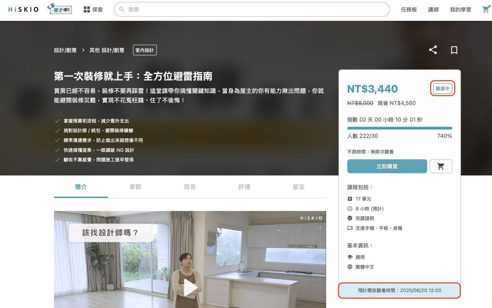
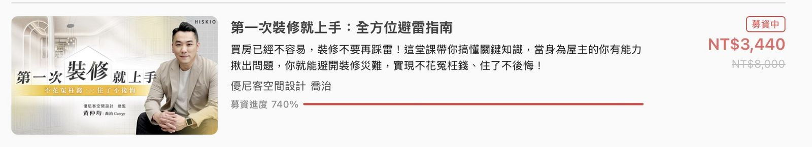

有關的文章： [課程購買](/zh-tw/category/6kqy56il6lo86lk3-q6krs8/)

# 課程募資

### 什麼是募資課程？

  

為了確保講師能開設符合學生需求的課程，HiSKIO 推出課程募資制度，在正式開課前透過募資制度的設立答標門檻的方式，來確認講師設計的課程是符合學生需求，不但減少講師開設沒有需求的課程而耗費時間與精力，在募資階段也能提供學生優惠價格。

  

### 如何分辨募資課程？

  

1.在課程銷售頁面，課程價格旁將標記「 ****募資中**** 」，並且標示此課程的「預計開放觀看時間」

  

  

2.當你搜尋課程時，課程會標記「募資中」狀態

  

  

### 募資課程如何購買？

  

與一般課程購買方式相同，歡迎參考「 [課程購買](/zh-tw/article/6kqy56il6lo86lk3-1n449z6/) 」。

  

### 募資課程可以試閱嗎？

  

由於募資課程講師會於課程募資成功後才開始製課，因此不提供課程試閱，您可以透過課程簡介與簡介影片確認課程內容是否符合您的需求，若對於課程有任何疑問，也可以在「課前問答」中向講師提問喔！

  

### 募資課程如何退款？

  

募資課程原則上於課程正式上架前皆可申請全額退費，詳情可參閱「 [課程退費](/zh-tw/article/4pan6yca6lk76kap5a6a-1tt5d5r/) 」說明。

更新時間： 27/05/2025
