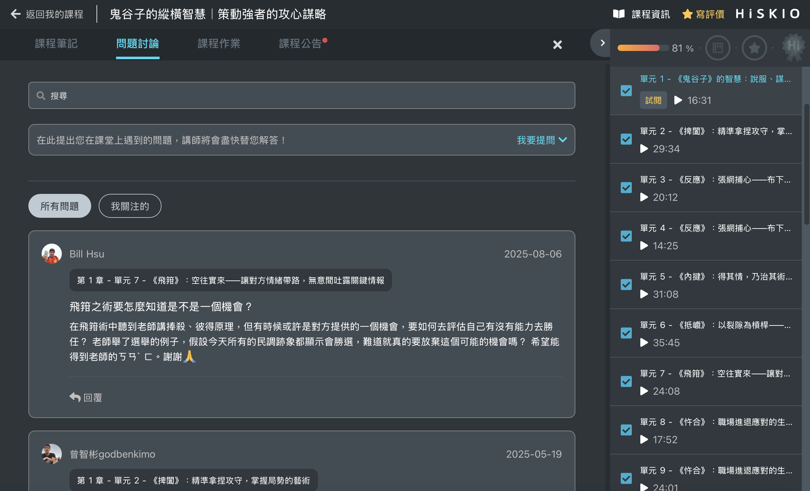

有關的文章： [開始上課](/zh-tw/category/6zal5ael5lik6kqy-x12iv/)

# 課程學習中遇到問題，該到哪裡尋求協助？

學習過程中如果有疑問，可以透過以下兩種方式尋求協助：

  

  

### 問題討論區

  

每堂課程都有獨立的問題討論區，可以與老師交流、解決學習上遇到的問題；也能與其他學員交流心得。

  

#### 進入問題討論的方式

  

1.  進入學習頁面
2.  點選下方「問題討論」
3.  在這裡選擇章節並提問，也可以瀏覽其他學員的提問互相交流

  

  

  

### 交流社團／群組

  

依照課程不同，講師可能會提供專屬的交流管道（如 Facebook 社團、LINE@、LINE 社群等），於學員完成課程購買時提供加入方式。

  

加入後可以更快速地獲得學習相關的協助與資訊，也能與同學互相交流。建議購買後留意通知，記得加入！

更新時間： 07/05/2026
