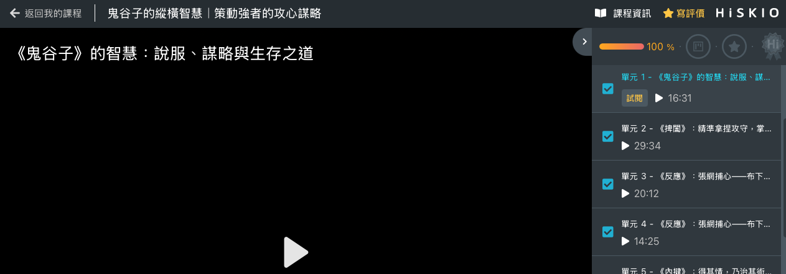
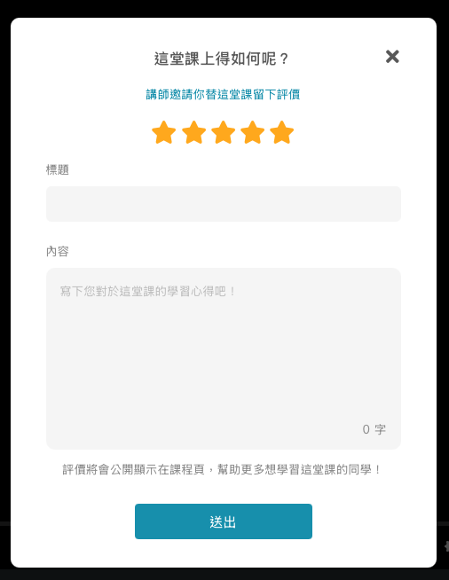

有關的文章： [開始上課](/zh-tw/category/6zal5ael5lik6kqy-x12iv/)

# 課程評價

評價是為了讓更多想學習的夥伴，在加入課程前透過學員的回饋了解這門課是否適合自己。請多多給予老師鼓勵或建議，讓課程持續進步。

  

若你還不確定自己是否適合這堂課程，歡迎參考 [購買前如何確認課程適合我？](/zh-tw/article/6lo86lk35ymn5aac5l2v56k66kqn6kqy56il6ygp5zci5oir77yf-udkj42/)，先從課程介紹、章節目錄與試閱影片著手判斷。

  

  

### 如何對課程進行評價

  

完成大部份課程內容後，可在學習頁面右上角點選「寫評價」進入評價頁面。

  

  

進入後即可留下對課程的評價與心得。

  

  

  

### 評價無法修改

  

評價送出後僅有一次調整機會。經修改後，無法再次調整。  
送出前請再次檢查內容。

  

  

### 注意事項

  

課程評價有助於尚未購課的學生判斷課程的內容是否合適，同時也能鼓勵講師持續產出高品質的課程。然而，評價時請注意基本禮儀，避免造成他人困惑、不適或引發爭議與衝突，若評論包含惡意攻擊、散播不實謠言或誹謗，經查證屬實後須負上法律責任。

  

請於發布評價時遵守：

  

-   請勿偏離主題，評價內容應與您所評論的課程有關

  

-   請勿在評價中僅留下無意義之字串、數字、符號

  

-   請勿在評價中包含任何宣傳廣告、Email 或連結

  

-   請勿發佈帶有暴力、恨意、情色、歧視之言論，或內容涉及人身攻擊

  

-   請勿為了增加或降低課程平均星等，而發佈不實評價

  

-   請勿發佈你或他人的隱私或機密資訊，例如郵寄地址、手機號碼或任何其他未公開的資訊

  

  

為了使您的評價內容更具參考價值，建議您可參考下列幾點規範發布評價：

  

-   保持理性、尊重的心態對待他人，切勿讓情緒言詞導致您的內容失真

  

-   在送出前檢查有沒有錯字，提供可順暢理解、容易閱讀的評價

  

-   發佈真實、實用、具參考意義的評論，讓平台使用者藉由評價瞭解您的學習體驗，讓講師擁有足夠的資訊針對課程進行調整或補充

  

-   您可以試著提供正反兩面的評價，讓評價更能幫助他人考慮挑選課程：

  

  

例如：

  

（正面）講師在授課時提供豐富的範例，由淺入深的讓我能快速理解課程內容。

  

（反面）講師授課內容過於艱澀，不適合新手或是沒有相關基礎的人來上。

  

最後，若您有課程以外想要對平台提出的建議，歡迎在「對於 HiSKIO 平台功能有任何建議嗎？」欄位回饋您的想法，或者透過右下方客服對話視窗來訊告知您的建議與回饋，讓 HiSKIO 能更加進步。

更新時間： 07/05/2026
