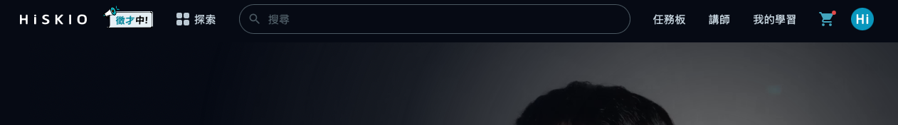
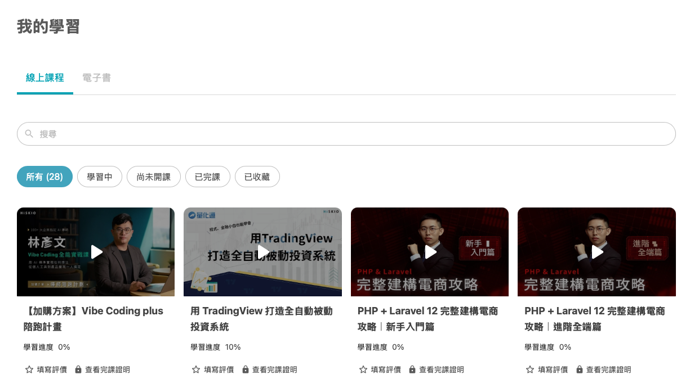
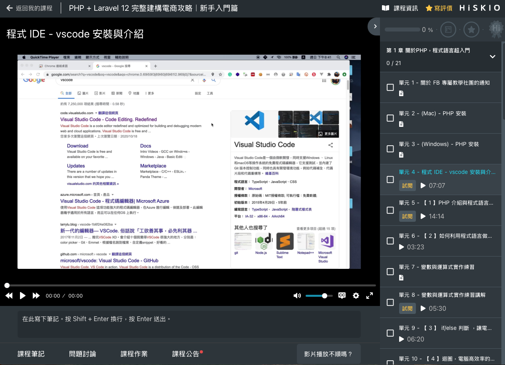

有關的文章： [開始上課](/zh-tw/category/6zal5ael5lik6kqy-x12iv/)

# 開始上課

完成課程購買後，本篇帶你了解如何開始上課、HiSKIO 上課介面有什麼功能，以及學習過程中可使用的工具。

  

  

### 完成購買後，到哪裡看課程？

  

#### 1\. 點選右上方的【我的學習】

  

登入 HiSKIO 帳號後，直接點選網站右上方的【我的學習】即可。

  

  

#### 2\. 在「我的學習」看到所有已購買的課程

  

進入「我的學習」後，可看到帳號內所有已購買的課程。

  

  

> 💡 如果在「我的學習」找不到你已經買的課程，可能是登入到不同帳號了，請參考 [帳號查詢與「課程不見了」排解](/zh-tw/article/5biz6jmf5pl6kmi6iih44cm6kqy56il5lin6kal5lqg44cn5o6s6kej-hipkzv/)。

  

#### 3\. 點擊任一堂課，進入上課介面

  

點擊任一堂課的封面，即進入上課介面開始學習。

  

  

> ⚠️ ****重要提醒****：若你點擊\*\*沒有標記【試閱】\*\*的課程單元，系統會判定你已開始學習該課程，****將不符合退費資格****。如果還在評估是否要退費，請務必先閱讀 [退費規定｜如何申請退費](/zh-tw/article/6yca6lk76kap5a6a772c5aac5l2v55sz6kul6yca6lk7-1n22a1s/)。

  

  

### 上課介面有什麼？

  

進入課程後，主要可以看到：

  

-   ****影片播放區****：播放課程影片，可調整解析度、播放速度
-   ****章節目錄****：列出所有單元，可自由切換
-   ****問題討論****：與講師、同學就課程內容互動
-   ****筆記功能****：邊看邊做筆記
-   ****作業繳交區****：若課程提供作業單元，可在此上傳作業

  

  

### 學習工具

  

#### 筆記

  

可在邊看影片時記下重點。詳細操作請參考 [如何製作、查詢筆記](https://help.hiskio.com/zh-tw/article/5aac5l2v6ko95l2c44cb5pl6kmi562g6kiy-pjk8dl/)。

  

#### 學習進度

  

系統會自動記錄你的觀看進度，****單支影片觀看達 90% 時系統會自動標記為已完成****。你也可以在「我的學習」頁面查看每堂課程的整體進度。

  

#### 問題討論

  

若對課程內容有疑問，可在課程頁面下方的【問題討論】區留言，講師會盡快回覆。也可以瀏覽其他同學已被解答的問題，或許能找到解答。

  

#### 作業繳交

  

若課程提供作業單元，於該單元頁面下方可上傳作業檔案。

  

> 💡 若沒看到繳交按鈕，請嘗試重新整理頁面。

  

#### 課程評價

  

學習過程中或完成課程後，皆可在課程頁面留下評價分享心得。詳細規範請參考 [HiSKIO 課程評價規範](https://help.hiskio.com/zh-tw/article/hiskio-15g1non/)。

  

#### 完課證明

  

完成全部單元後可申請完課證明。詳細條件與申請方式請參考 [完成課程後，會提供完課證明嗎？](https://help.hiskio.com/zh-tw/article/5a6m5oiq6kqy56il5b6m77ym5pyd5oq5l6b5a6m6kqy6k2j5pio5zeo77yf-fhfabi/)。

  

  

### 在不同裝置上課

  

HiSKIO 提供****手機友善的網頁版****，平板、手機與電腦皆可正常使用，使用相同的 HiSKIO 帳號登入即可。

  

#### 行動裝置建議瀏覽器

  

-   ****iPhone / iPad****：Safari 或 Chrome
-   ****Android****：Chrome

  

#### 多裝置同時觀看

  

若你在多個裝置同時播放同一堂課，****另一端裝置將會被強制登出****，建議選定一個主要裝置進行學習。

  

  

### 學習中遇到問題

  

狀況

該看哪一篇

影片播放卡頓、黑畫面、無法載入

[影片播放問題排解](/zh-tw/article/5b2x54mh5pkt5ps5zwp6agm5o6s6kej-15zaxsc/)

找不到購買的課程

[帳號查詢與「課程不見了」排解](/zh-tw/article/5biz6jmf5pl6kmi6iih44cm6kqy56il5lin6kal5lqg44cn5o6s6kej-hipkzv/)

想退費

[退費規定｜如何申請退費](/zh-tw/article/6yca6lk76kap5a6a772c5aac5l2v55sz6kul6yca6lk7-1n22a1s/)

  

  

### 仍無法解決？

  

請聯繫客服並提供：

  

-   註冊時使用的 Email
-   課程名稱與遇到問題的單元
-   你使用的裝置／瀏覽器
-   錯誤訊息或畫面截圖

  

寄信至 [support@hiskio.com](mailto:support@hiskio.com)

更新時間： 07/05/2026
